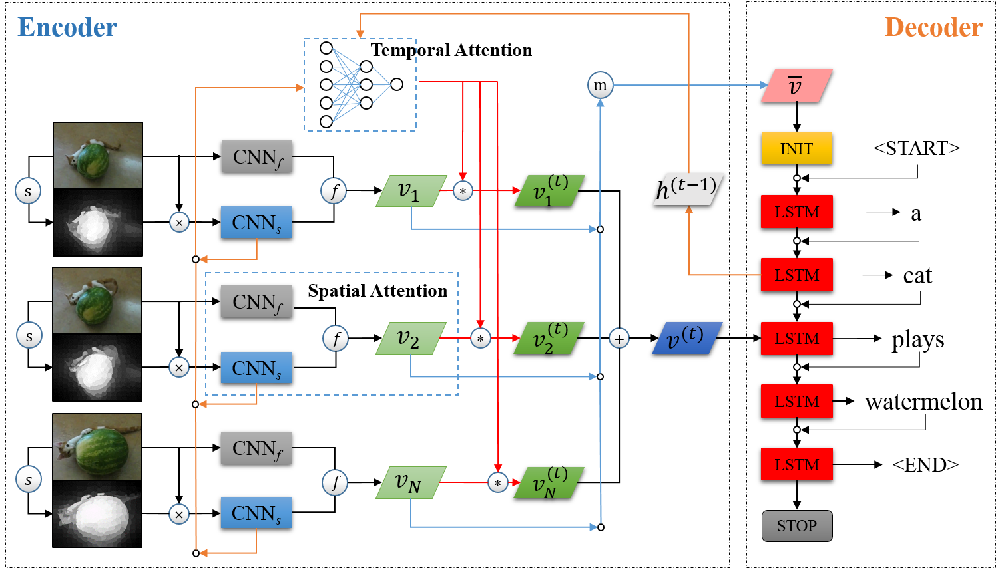
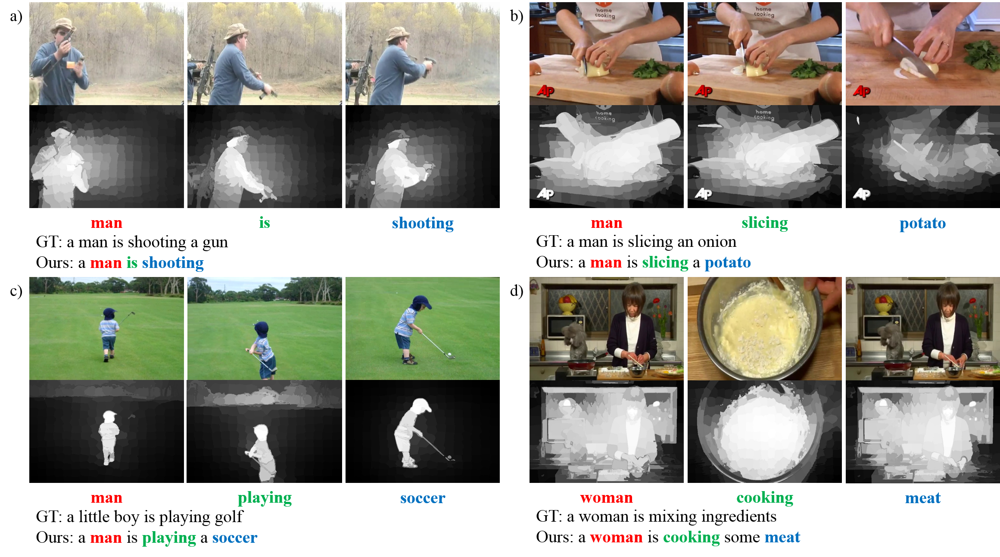

# Tracking

- [x] Training and testing code
- [ ] Train the model and report the results

# Introduction
This is the repository for the VTT research and challenge. The current project is based on the SSAT mdoel as follows:



- Related paper: [Supervising Neural Attention Models for Video Captioning by Human Gaze Data](http://openaccess.thecvf.com/content_cvpr_2017/papers/Yu_Supervising_Neural_Attention_CVPR_2017_paper.pdf)

# Requirements
## Pretrained Model
- VGG16 pretrained on ImageNet [PyTorch version]: https://download.pytorch.org/models/vgg16-397923af.pth
## Datasets
- MSVD: https://www.microsoft.com/en-us/download/details.aspx?id=52422
- MSR-VTT: http://ms-multimedia-challenge.com/2017/dataset

**Obtain the dataset you need:**

* [MSR-VTT](http://ms-multimedia-challenge.com/dataset):
[train_val_videos.zip](http://202.38.69.241/static/resource/train_val_videos.zip),
[train_val_annotation.zip](http://202.38.69.241/static/resource/train_val_annotation.zip),
[test_videos.zip](http://202.38.69.241/static/resource/test_videos.zip),
[test_videodatainfo.json](http://ms-multimedia-challenge.com/static/resource/test_videodatainfo.json)

* [Flickr30k](http://shannon.cs.illinois.edu/DenotationGraph/): flickr30k.tar.gz, flickr30k-images.tar

## Packages
```
- torch, torchvision, numpy, scikit-image, nltk, h5py, pandas, future  # python2 only
- tensorboard_logger  # for use tensorboard to view training loss
```
You can use:
```bash
(sudo) pip2 install -r requirements.txt
```
To install all the above packages.
# Usage
## Preparing Data
Firstly, we should make soft links to the dataset folder and pretrained models. For example:
```bash
mkdir datasets
ln -s YOUR_MSVD_DATASET_PATH datasets/MSVD
mkdir models
ln -s YOUR_VGG16_MODEL_PATH models/
```

Somes detail can be found in args.py.

Then we can:

1. Prepare video feature:
```bash
python2 video.py
```

2. Prepare caption feature and dataset split:
```bash
python2 caption.py
```

## Training and Testing
Before training the model, please make sure you can use GPU to accelerate computation in PyTorch. Some parameters, such as batch size and learning rate, can be found in args.py.

- Train:
```bash
python2 train.py
```

- Evaluate:
```bash
python2 evaluate.py
```
- Sample some examples:
```bash
python2 sample.py
```


# Results
## Quantity
The following table gives a benchmark of video captioning methods on MSVD dataset. Our methods are STA(only use temporal attention), SSTA-S(use saliency region for spatial attention), SSTA-C(use both saliency region and full frame for spatial attention) and SSTA-R(use residual block to decide spatial attention).

| Model               |       B1 |       B2 |      B3 |       B4 |       M |       Cr |
| :------             | :------: | :------: | ------: | :------: | ------: | :------: |
| SA(GoogLeNet)       |        - |        - |       - |     40.3 |    29.0 |     48.1 |
| SA(GoogLeNet+C3D)   |        - |        - |       - |     41.9 |    29.6 |     51.7 |
| SV2T(VGG16)         |        - |        - |       - |        - |    29.2 |        - |
| S2VT(VGG16+OF)      |        - |        - |       - |        - |    29.8 |        - |
| LSTM-E(VGG19)       |     74.9 |     60.9 |    50.6 |     40.2 |    29.5 |        - |
| LSTM-E(VGG19+C3D)   |     78.8 |     66.0 |    55.4 |     45.3 |    31.0 |        - |
| p-RNN(VGG)          |     77.3 |     64.5 |    54.6 |     44.3 |    31.1 |     62.1 |
| p-RNN(VGG+C3D)      |     81.5 |     70.4 |    60.4 |     49.9 |    32.6 |     65.8 |
| HRNE(GoogLeNet)     |     79.2 |     66.3 |    55.1 |     43.8 |    33.1 |        - |
| HRNE(GoogLeNet+C3D) |     81.1 |     68.6 |    57.8 |     46.7 |    33.9 |        - |
| STA(VGG16)          |     75.5 |     61.4 |    50.6 |     40.2 |    30.0 |     58.9 |
| SSTA-S(VGG16)       |     73.1 |     58.3 |    47.7 |     37.1 |    28.9 |     54.0 |
| SSTA-C(VGG16)       |     75.7 |     61.5 |    50.4 |     39.8 |    30.1 |     57.9 |
| SSTA-R(VGG16)       |     82.1 |     66.9 |    56.0 |     45.3 |    30.3 |     59.2 |

## Quality
We select some good and bad examples to demonstrate the pros and cons of our method.

